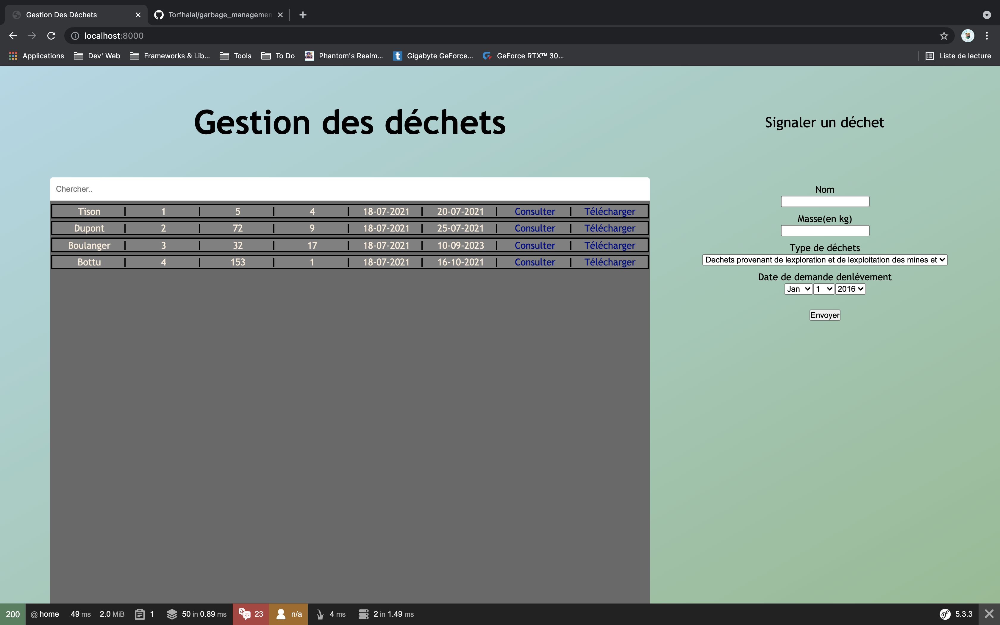
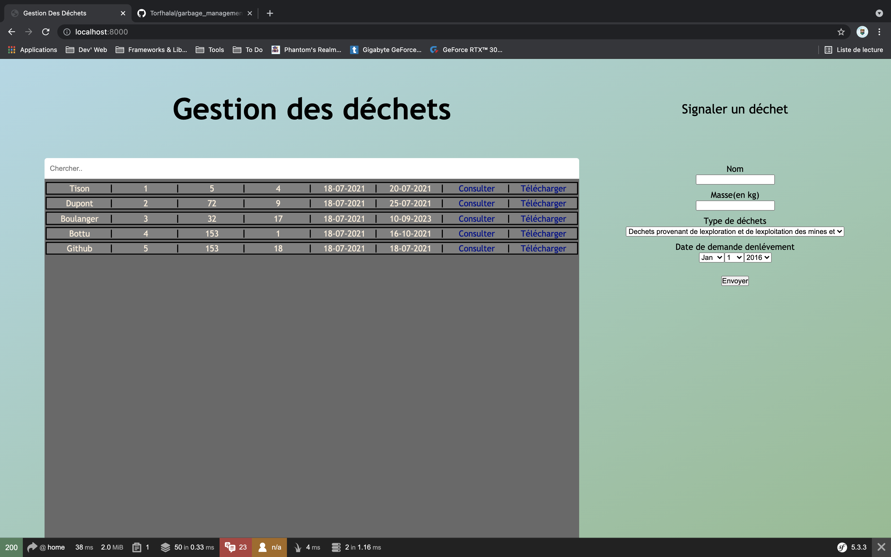

# Garbage Management

> The first Symfony application I made - HUGGII entry test

## Table of Contents

- [Garbage Management](#garbage-management)
  - [Table of Contents](#table-of-contents)
  - [General Information](#general-information)
  - [Technologies Used](#technologies-used)
  - [Features](#features)
  - [Screenshots](#screenshots)
  - [Setup](#setup)
  - [Usage](#usage)
  - [Project Status](#project-status)
  - [Room for Improvement](#room-for-improvement)
  - [Contact](#contact)

## General Information

- I had to develop a web application for a garbage management company in PHP or Symfony.
- It was a test for the HUGGII company and I decided to make it in Symfony.

## Technologies Used

- [Symfony](https://symfony.com/)

## Features

- User can create a garbage
- Garbage list page
- User can order garbages by submit date

## Screenshots

## Setup

_To do_

## Usage

composer install
symfony server:start / php bin/console server:run

psql -U postgres
INSERT INTO garbage (id, name, reference, weight, nomenclature, creation, request) VALUES (1, 'carton', 23213, 23, 12, '2022-11-25', '2022-11-25');

_To do_

## Project Status

Project is: _no longer being worked on_.

## Room for Improvement

To do:

- While create, a PDF file is create (named BSD) and can be preview/download (Environment problem, will be fixed soon)

- User can order garbages by treatment request date (Need to done it with Ajax cause no refresh allowed)

## Contact

Created by [@alextison](https://www.github.com/alextison) - feel free to contact me!
